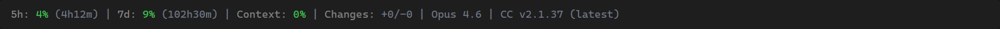
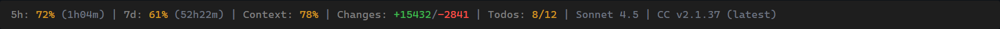
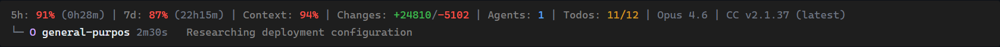

# Claude Code HUD

A custom statusline for [Claude Code](https://docs.anthropic.com/en/docs/claude-code) that displays real-time rate limits, context usage, running agents, and more — right in your terminal.

Zero dependencies. Pure Node.js. Works standalone or with [oh-my-claudecode](https://github.com/nicobailon/oh-my-claudecode).

## Screenshots

**Fresh session** — all green, low usage, latest version:



**Active development** — agents running, code changes tracked, update available:


**Heavy session** — yellow warnings as usage climbs, todo progress tracking:



**Near the limit** — red critical indicators, agent details inline:



## What It Shows

| Segment | Source | Description |
|---------|--------|-------------|
| **5h / 7d** | Anthropic OAuth API | Rate limit usage with countdown to reset |
| **Context** | Claude Code stdin | Context window fill percentage |
| **Changes** | Claude Code stdin | Lines added / removed this session |
| **Agents** | Transcript JSONL | Count + tree view of running background agents |
| **Todos** | Transcript JSONL | Task completion progress (done/total) |
| **Model** | Claude Code stdin | Active model (Opus 4.6, Sonnet 4.5, etc.) |
| **Version** | npm registry | Claude Code version with update notification |

### Color Thresholds

Values change color based on severity:

| Level | Rate Limits | Context Window |
|-------|-------------|----------------|
| Green | < 60% | < 70% |
| Yellow | 60–79% | 70–84% |
| Red | 80%+ | 85%+ |

## Setup

### Standalone (recommended)

1. Copy `custom-hud.mjs` somewhere permanent:
   ```bash
   mkdir -p ~/.claude/hud
   cp custom-hud.mjs ~/.claude/hud/custom-hud.mjs
   ```

2. Configure Claude Code to use it. Add to your `~/.claude/settings.json`:
   ```json
   {
     "env": {
       "CLAUDE_CODE_STATUSLINE_COMMAND": "node ~/.claude/hud/custom-hud.mjs"
     }
   }
   ```

3. Restart Claude Code. The HUD appears automatically.

### With oh-my-claudecode

If you use [oh-my-claudecode](https://github.com/nicobailon/oh-my-claudecode), the `omc-hud.mjs` wrapper auto-discovers the OMC plugin. Just install OMC and the HUD plugin loads from cache.

## How It Works

Claude Code pipes JSON to the statusline command via stdin on every render cycle. The HUD:

1. **Parses stdin** for context window stats, model info, transcript path, and cost data
2. **Fetches rate limits** from the Anthropic OAuth API (cached 60s) using your existing Claude Code credentials
3. **Parses the transcript** JSONL file to find running agents and todo progress
4. **Checks npm** for the latest Claude Code version (cached 1 hour)
5. **Renders** a color-coded single-line status with optional agent detail rows

All data fetching runs concurrently via `Promise.all` to minimize latency.

### Agent Tracking

Running agents are displayed in a tree view below the main status line:

- Badge shows the model: `O` (Opus), `s` (Sonnet), `h` (Haiku)
- Elapsed time since agent started
- Agent type and description
- Agents older than 30 minutes are automatically marked stale
- Up to 100 agents tracked, with oldest completed agents evicted first

### Caching

| Data | TTL | Location |
|------|-----|----------|
| Rate limits | 60s (15s on error) | `~/.claude/hud/.usage-cache.json` |
| npm version | 1 hour | `~/.claude/hud/.version-cache.json` |

## Requirements

- Node.js 18+
- Claude Code with an active Anthropic OAuth session (for rate limit data)

## License

MIT
