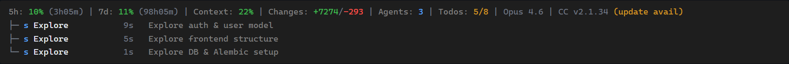
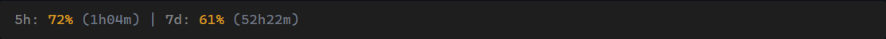
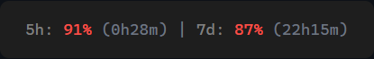
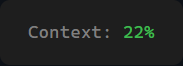
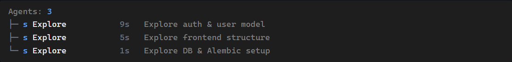
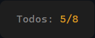
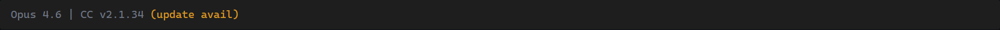

# Claude Code HUD

A custom statusline for [Claude Code](https://docs.anthropic.com/en/docs/claude-code) that shows your rate limits, context usage, running agents, and more — right in your terminal.

No dependencies to install. Just one file.

---

## The Full Picture

Here's what the HUD looks like with all features active — rate limits, context, changes, agents, todos, model, and version info all in one line:

[](https://raw.githubusercontent.com/professionalcrastinationco/METRICC/main/docs/images/hud-full-bar.png)

> **Tip:** Click the image above to view it full-size.

---

## What Each Piece Means

The screenshots below are **zoomed-in views** of each segment of the status bar so they're easy to read here on GitHub. These all sit side-by-side in a single line — to see the assembled result, scroll up to [The Full Picture](#the-full-picture) or click any segment image to view it full-size.

---

### Rate Limits — `5h` and `7d`


Your Anthropic API usage across two windows: the **5-hour** rolling window and the **7-day** rolling window. The percentage shows how much of your limit you've used. The time in parentheses is a countdown until that window resets.

The color changes automatically as you use more of your limit:

**Yellow** — getting close (60%+):



**Red** — almost out (80%+):



---

### Context Window



How full the current conversation's context window is. This is the amount of "memory" Claude has for this session. The same green/yellow/red color coding applies — it turns yellow at 70% and red at 85%.

---

### Code Changes


Lines of code **added** (green) and **removed** (red) during this session. A quick way to gauge how much work has been done without running `git diff`.

---

### Running Agents



When Claude Code launches background agents (for research, exploration, etc.), they appear here. The count shows how many are active, and a tree view below the main bar shows details for each one:

- The letter badge shows the model — **s** (Sonnet), **O** (Opus), **h** (Haiku)
- How long the agent has been running
- What the agent is doing

Agents that have been running for over 30 minutes are automatically marked as stale and hidden.

---

### Todo Progress



When Claude Code is tracking tasks (via `TodoWrite` or `TaskCreate`), this shows how many are done out of the total. Yellow means there's still work to do — it turns green when all tasks are complete.

---

### Model and Version



The Claude model you're currently using (Opus 4.6, Sonnet 4.5, Haiku 4.5, etc.) and your Claude Code version. If a newer version is available, you'll see **(update avail)** in yellow. If you're on the latest, it just says **(latest)**.

---

## Setup

There are two steps: **save the file**, then **point Claude Code to it**.

### Step 1 — Save the script

You need to put `custom-hud.mjs` in a folder where it will stay. The recommended location is inside your Claude Code config folder.

<details>
<summary><strong>macOS / Linux</strong></summary>

Open a terminal and run:

```bash
mkdir -p ~/.claude/hud
curl -o ~/.claude/hud/custom-hud.mjs https://raw.githubusercontent.com/professionalcrastinationco/METRICC/main/custom-hud.mjs
```

This creates the folder and downloads the file in one go.

Your file is now at: `~/.claude/hud/custom-hud.mjs`

</details>

<details>
<summary><strong>Windows (PowerShell)</strong></summary>

Open PowerShell and run:

```powershell
New-Item -ItemType Directory -Force -Path "$env:USERPROFILE\.claude\hud"
Invoke-WebRequest -Uri "https://raw.githubusercontent.com/professionalcrastinationco/METRICC/main/custom-hud.mjs" -OutFile "$env:USERPROFILE\.claude\hud\custom-hud.mjs"
```

Your file is now at: `C:\Users\<your-username>\.claude\hud\custom-hud.mjs`

</details>

<details>
<summary><strong>Manual download (any OS)</strong></summary>

1. Click on `custom-hud.mjs` in this repo
2. Click the **Raw** button (or **Download**)
3. Save the file to:
   - **macOS / Linux:** `~/.claude/hud/custom-hud.mjs`
   - **Windows:** `C:\Users\<your-username>\.claude\hud\custom-hud.mjs`
4. Create the `hud` folder first if it doesn't exist

</details>

### Step 2 — Tell Claude Code to use it

You need to add one setting to your Claude Code settings file.

**Where is the settings file?**

| OS | Path |
|----|------|
| macOS / Linux | `~/.claude/settings.json` |
| Windows | `C:\Users\<your-username>\.claude\settings.json` |

> If this file doesn't exist yet, just create it.

**Add this to your settings file:**

```json
{
  "env": {
    "CLAUDE_CODE_STATUSLINE_COMMAND": "node ~/.claude/hud/custom-hud.mjs"
  }
}
```

> **Windows users:** Replace the path with your full Windows path:
> ```json
> "CLAUDE_CODE_STATUSLINE_COMMAND": "node C:\\Users\\YourName\\.claude\\hud\\custom-hud.mjs"
> ```

If your settings file already has content, just add the `CLAUDE_CODE_STATUSLINE_COMMAND` line inside the existing `"env"` section. Don't replace what's already there.

<details>
<summary>Example: merging with existing settings</summary>

If your `settings.json` currently looks like this:

```json
{
  "env": {
    "SOME_OTHER_SETTING": "value"
  }
}
```

Add the new line with a comma:

```json
{
  "env": {
    "SOME_OTHER_SETTING": "value",
    "CLAUDE_CODE_STATUSLINE_COMMAND": "node ~/.claude/hud/custom-hud.mjs"
  }
}
```

</details>

### Step 3 — Restart Claude Code

Close and reopen Claude Code. The HUD will appear at the bottom of your terminal automatically.

> **Tip:** You can also ask Claude Code to do Step 2 for you. Just tell it:
> *"Set my statusline command to `node ~/.claude/hud/custom-hud.mjs`"*

### Using with oh-my-claudecode

If you already use [oh-my-claudecode](https://github.com/nicobailon/oh-my-claudecode), the included `omc-hud.mjs` wrapper auto-discovers the OMC plugin — no extra setup needed.

## Requirements

- **Node.js 18 or newer** — you already have this if Claude Code is installed
- **Claude Code** with an active login — the HUD uses your existing session for rate limit data

<details>
<summary><strong>Technical Details</strong></summary>

### How It Works

Claude Code sends JSON data to the statusline command every time the display refreshes. The HUD reads that data and:

1. Calculates context window usage from token counts
2. Fetches your rate limits from the Anthropic API (cached for 60 seconds)
3. Reads the session transcript to find running agents and todo progress
4. Checks npm for the latest Claude Code version (cached for 1 hour)
5. Renders everything as a color-coded status line

All network requests happen simultaneously so the HUD stays fast.

### Agent Tracking

When agents are running, they appear in a tree view below the main status line:

- A letter badge shows the model: **O** (Opus), **s** (Sonnet), **h** (Haiku)
- Elapsed time since the agent started
- The agent type and a short description
- Agents older than 30 minutes are automatically hidden
- Up to 100 agents are tracked per session

### Caching

| Data | Refreshes every | Stored at |
|------|-----------------|-----------|
| Rate limits | 60 seconds | `~/.claude/hud/.usage-cache.json` |
| CC version | 1 hour | `~/.claude/hud/.version-cache.json` |

</details>

## License

MIT
